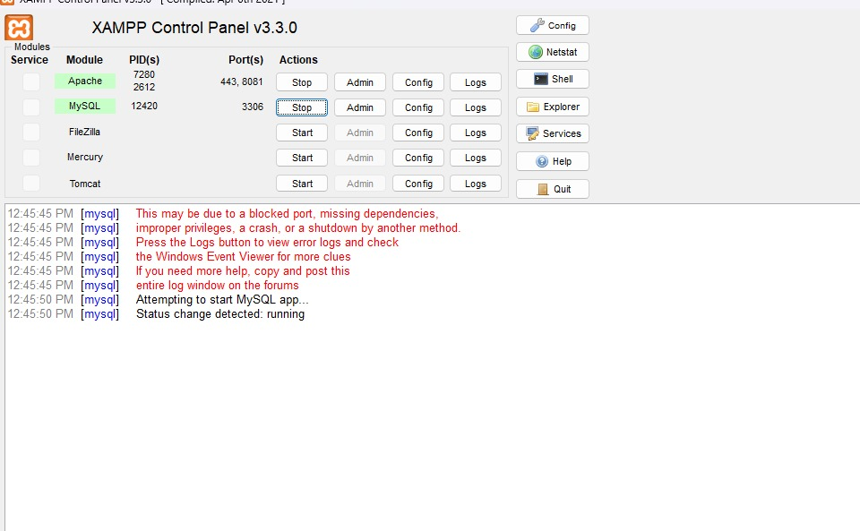
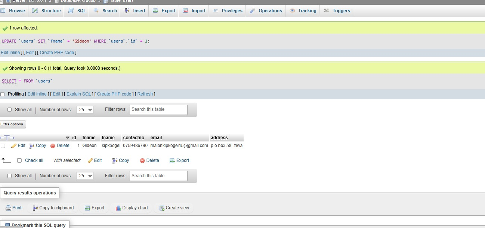
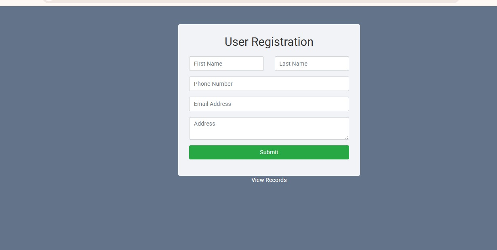
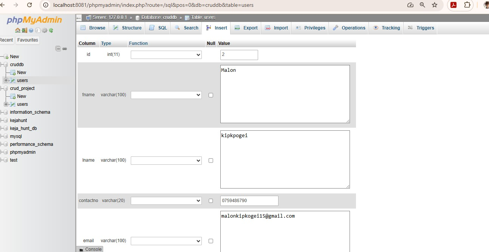
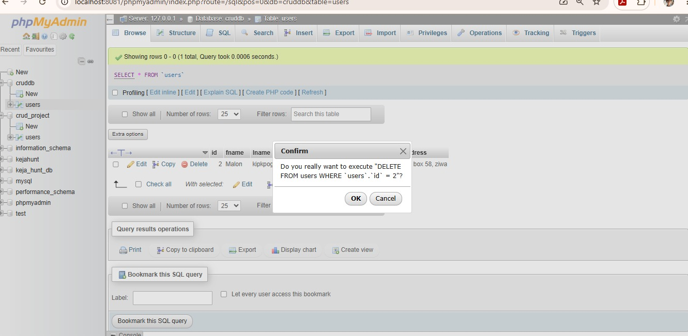

# CRUD Client-Server Application using PHP and MySQL

## Overview

This project is a simple client-server application developed using PHP, MySQL, HTML, CSS, and Bootstrap. The system demonstrates communication between a client (web browser), an application server (PHP running on Apache), and a database server (MySQL).

The application allows users to perform CRUD operations:

* Create new records
* Read/View existing records
* Update records
* Delete records
* Search records

---

## Technologies Used

* PHP
* MySQL
* HTML5
* CSS3
* Bootstrap 4
* Apache Server (XAMPP)

---

## System Architecture

### Client Layer

* Web Browser
* HTML Forms
* Bootstrap User Interface

### Application Layer

* PHP Scripts
* CRUD Business Logic
* Request Processing

### Database Layer

* MySQL Database
* Users Table

---

## Features

### Create

Users can add new records through a web form.

### Read

Users can view all records stored in the database.

### Update

Users can modify existing records.

### Delete

Users can remove records from the database.

### Search

Users can search records by name.

---

## Database Structure

Table: users

| Field     | Type              |
| --------- | ----------------- |
| id        | INT (Primary Key) |
| fname     | VARCHAR(100)      |
| lname     | VARCHAR(100)      |
| contactno | VARCHAR(20)       |
| email     | VARCHAR(100)      |
| address   | TEXT              |

---

## Project Structure

Crud_project/

├── create.php

├── index.php

├── edit.php

├── delete.php

├── dbconnection.php

├── screenshots/

└── README.md

---

## Client-Server Communication

1. User submits data through the browser.
2. PHP receives the HTTP request.
3. PHP executes SQL queries against MySQL.
4. MySQL returns results.
5. PHP generates a response.
6. Browser displays updated information.

---

## Installation

1. Install XAMPP.

2. Start Apache and MySQL.

3. Copy the project folder into htdocs.

4. Create the database:

   CREATE DATABASE cruddb;

5. Create the users table.

6. Open:

   http://localhost:8081/Crud_project/create.php

---

## Demonstration

The application successfully demonstrates:

* Client-server architecture
* Database connectivity
* CRUD functionality
* HTTP request-response communication
* Layered architecture design

---
## Overview

This project is a simple client-server application...

...

## Application Screenshots

### XAMPP Running

### Records Table

### Create Form

### Edit User

### Delete User

## Author

Mahlon Kipkogei

Software Development Student

A PHP and MySQL CRUD client-server application demonstrating Create, Read, Update, Delete, and Search operations using XAMPP localhost.
Update README with project documentation
Add application screenshots to README
